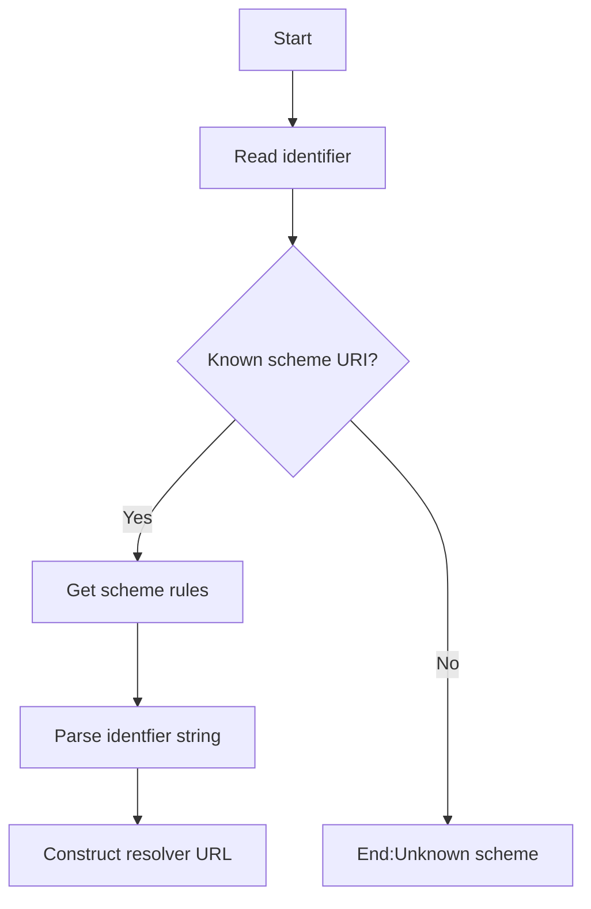
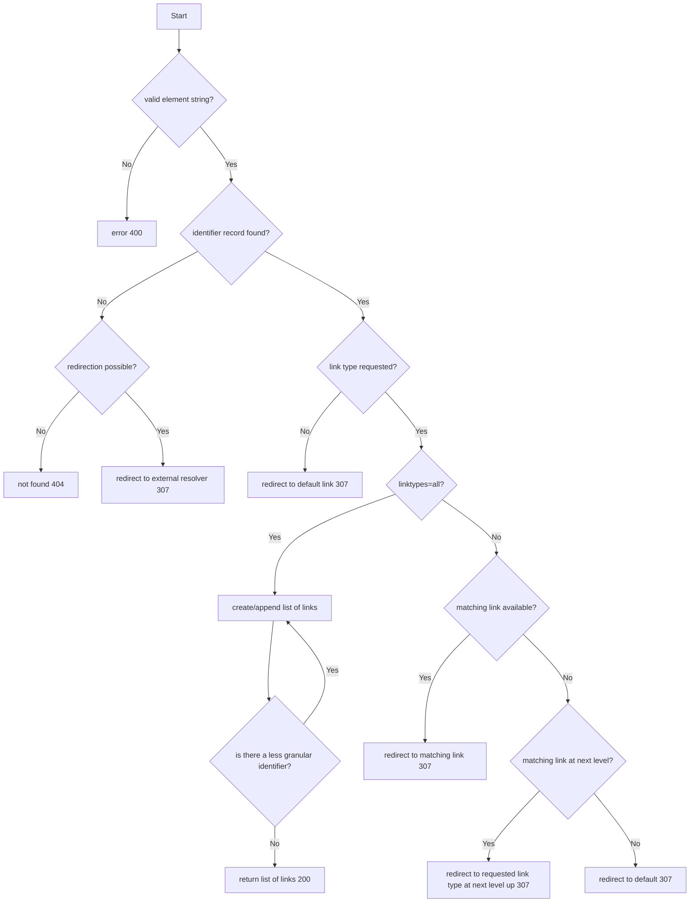

# Link resolution

Link resolution is generally a three-step process

1. The first step is to construct an ISO 18975 conforming URL
   from a given entity/facility/product identifier.
   This step can be skipped if the identifier is already
   a link resolver URL such as a QR code.  
2. The second step if to request link information
   from the identity resolver for the given entity/facility/product.
   The identity resolver will typically return a list of link types
   that indicate locations of further information.
   The returned links may point to further identity resolvers
   or other external locations. 
3. The final step is to follow one or more of the retreived links
   to obtain the specific information for that link type
   (eg a digital product passport).
   Some types of links (or further information)
   MAY require authorisation for secure data access.  

These steps may be merged into a single query
when the required link type is already known.
So, rather than "tell me what you have,
then I'll choose the link I want",
the single query is more like "give me the DPP for this product".


## Reference standards

ISO-18975 is a very minimal specification
that leaves many questions un-answered
(eg how to identify link types,
how to behave when asked about an unknown identifier
that is related to a known identifier).

Please refer to the detailed GS1 identity resolver specification
for more documentation - but remember to abstract it
to suit any identifier type (eg including non-gs1 identifiers).
https://ref.gs1.org/standards/resolver/ 


## Resolver discovery

The resolver discovery process is used to transform an identifier
(eg an ABN or a GTIN barcode)
into an ISO-18975 conforming identity resolver URL.
This step is not required when a ISO-18975 conforming resolver URL
is provided directly to the user
(eg as a QR code on a product or as a property in a data file).

This flow starts with the discovery of an identifier - whether scanned
from producty packaging or found in a digital document.



The scheme URI may either be provided with the identifier in a data file
(eg a DPP) as follows

```
"identifier": {
    "schemeURI":"ato.gov.au/abn",
    "identifierValue":"41161080146"
}
```

or the schemeURI may be known by the identity resolver client
due to the context of the identifier discovery.
For example when using an app to scan a GS1 GTIN as a 1-D barcode,
it is likely that the app already knows that it is scanning
a GS1 GTIN and will know the schemeURI is `id.gs1.org/gtin`

The next step is to lookup the resolver configuration file
for the given schemeURI.
The configuration file may already be available
to the link redeolver client or could be discovered
from an ecosystem manager such as the UNTP identifier scheme register.
The resolver configuration file will be of the form;

```
"identitySchemes":[
   {
    "schemeURI":"id.gs1.org/sgtin",
    "parsingTemplate":"Root <- 'sgtin' RestChars RestChars <- [a-zA-Z0-9]+",
    "resolverTemplate":"https://resolver.gs1.org/gtin/{id}",
    "linkTypes":"https://www.gs1.org/voc/?show=linktypes"
   },
   {
    next scheme...
   }
]
```

where

* schemeURI is the key to match the discovered schemeURI
  with the reelvant resolver configuraiton rules.
* parsingTemplate (if needed) provides rules
  about how to parse the idenifier
  needed for the identity resolver
  from the identifier string discovered by the client.
  For example to take the rightmost string
  from "urn:epc:id:sgtin:123456.23456.12345678".
* resolverTemplate provides the resolver URL with a placehoplder {id}
  which should be substituted for the discovered
  (and optionally parsed) identifier.
* linkTypes provides a vocabulary reference
  for the link types expected from the list resolver service. 


### Resolution flow

The resolution flow runs in the identity resolver service
when called with the identity resolver URL
constructed via the previous flow.
It needs to accomodate conditions where a resolution is requested
for an identifier that is unknown to the service
but is related to a known identifier - for example
calling GS1 global identity resolver with an sgtin
when it only knows about related gtin.




### Link types

Link types should be drawn from a controlled vocabulary
such as https://www.gs1.org/voc/?show=linktypes.
UNTP may define a catalog of controlled link type vocabularies.  

ResolverURLs may include the parameter ```linkType```
which can be set to any of the allowed link types
for the given identifier scheme or can be set to "all".
For example:

`https://resolver.gs1.org/gtin/9359502000010?linkType=gs1:sustainabilityInfo`

is requesting the resolver to redirect the query
to a target that provides sustainability information
about the GTIN 9359502000010

In the event that linkType is set to `all`,
the resolver should return a linkset structure as follows:

```
{ "linkset": [
{ "anchor": "https://resolver.gs1.org/gtin/9359502000010",
  "https://www.gs1.org/voc/sustainabilityInfo": [
  { "href": "https://dpp.acme.com/en/dpp-123456789",
    "title": "Product passport",
    "lang": ["en"]
  },
  { "href": "https://dpp.acme.com/en/dpp-123456789",
    "title": "Produktpass",
    "lang": ["de"]
  }],
  "https://www.gs1.org/voc/certificationInfo": [
    { "href": "https://conformityassess.com/phyto/87654321",
      "title": "Phytosanitary certificate"
    }]
}
```
