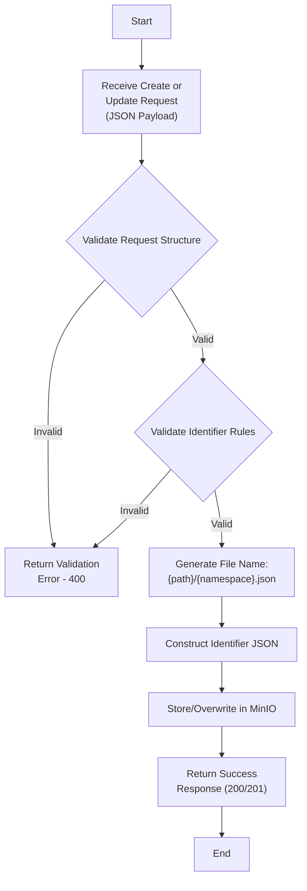
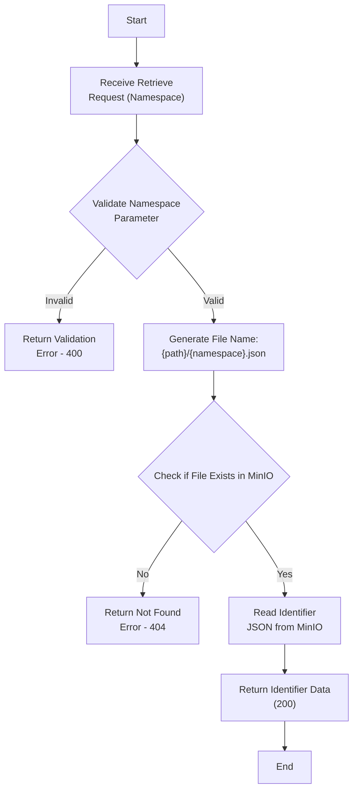
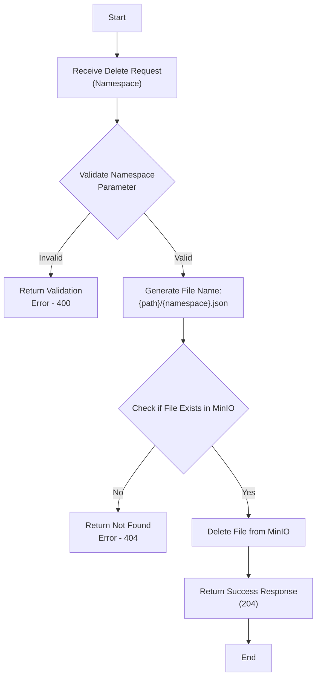

import Disclaimer from './../\_disclaimer.mdx';

<Disclaimer />

# Identifier Management

Authorized users can register identifier schemes using namespaces, and application identifiers that will be used in the Identity Digital Resolver (IDR) service.

## Identifier Structure

The identifier management system uses a JSON structure to define each namespace and its associated application identifiers. Each identifier scheme is stored in its own file, with the filename constructed as: `{OBJECT_STORAGE_BUCKET_NAME}/{IDENTIFIER_PATH}/{namespace}.json`.

Here's an example of the structure for a single identifier scheme:

```json
{
  "id": "identifiers/gs1",
  "namespace": "gs1",
  "namespaceURI": "",
  "namespaceProfile": "",
  "applicationIdentifiers": [
    {
      "title": "Global Trade Item Number (GTIN)",
      "label": "GTIN",
      "shortcode": "gtin",
      "ai": "01",
      "type": "I",
      "regex": "(\\d{12,14}|\\d{8})",
      "qualifiers": ["10"]
    },
    {
      "title": "Batch or lot number",
      "label": "BATCH/LOT",
      "shortcode": "lot",
      "ai": "10",
      "type": "Q",
      "regex": "([\\x21-\\x22\\x25-\\x2F\\x30-\\x39\\x41-\\x5A\\x5F\\x61-\\x7A]{0,20})"
    }
  ]
}
```

## Identifier Properties

Each identifier JSON object consists of the following top-level properties:

- `id`: A unique identifier for the scheme, in the format `{IDENTIFIER_PATH}/{namespace}`
- `namespace`: The namespace of the identifier scheme
- `namespaceURI`: The base URI of the namespace link type vocabulary (if applicable). Defaults to internal URI `http://localhost:3000/api/1.0.0/voc/`.
- `namespaceProfile`: The URI to the link type vocabulary profile of the namespace (if applicable). Defaults to internal URI `http://localhost:3000/api/1.0.0/voc/?show=linktypes`.
- `applicationIdentifiers`: An array of application identifiers associated with this namespace that can be registered with the IDR.

### Create/Update Identifier Flow



### Retrieve Identifier Flow



### Delete Identifier Flow



## Application Identifier Properties

Each application identifier within the `applicationIdentifiers` array consists of the following properties:

- `title`: The full name of the application identifier
- `label`: A short label for the application identifier
- `shortcode`: A concise code for quick reference
- `ai`: The unique application identifier number within the namespace
- `type`: The identifier type, which can be:
  - `I`: Identifier
  - `Q`: Qualifier
  - `D`: Data attribute
- `regex`: A regular expression pattern for validation
- `qualifiers`: A list of qualifiers used for identification and resolution (optional)

## Identifier Types and Prerequisites

The IDR system supports three types of application identifiers, each with its own role and prerequisites:

### 1. Identifier (I)

- **Role**: Serves as the primary identifier for a resource.
- **Prerequisites**:
  - Must have a unique `ai` within the namespace.
  - Can have optional qualifiers.
  - Must have a valid `regex` pattern for validation.

### 2. Qualifier (Q)

- **Role**: Provides additional context or specificity to a primary identifier.
- **Prerequisites**:
  - Must have a unique `ai` within the namespace.
  - Must be listed as a qualifier for at least one Identifier type within the same namespace.
  - Must have a valid `regex` pattern for validation.
  - Cannot have qualifiers of its own.

### 3. Data Attribute (D)

- **Role**: Represents additional data associated with an identifier but not used for resolution.
- **Prerequisites**:
  - Must have a unique `ai` within the namespace.
  - Must have a valid `regex` pattern for validation.
  - Cannot have qualifiers.
  - Is not used in the resolution process.

### General Prerequisites

- Each namespace must have at least one Identifier type.
- The combination of namespace and primary identifier (Identifier type) must be unique across the entire system.
- All application identifiers within a namespace must have unique `ai` and `shortcode` values.
- The `regex` patterns must be valid and appropriate for the data they are meant to validate.
- Qualifiers listed for an Identifier type must exist as Qualifier types within the same namespace.

## API Operations

The Identifier Management API supports the following operations:

1. Create or update an identifier
2. Retrieve an identifier by namespace
3. Delete an identifier by namespace

See the [API specification](http://localhost:3000/api-docs#/Identifiers) for details.
