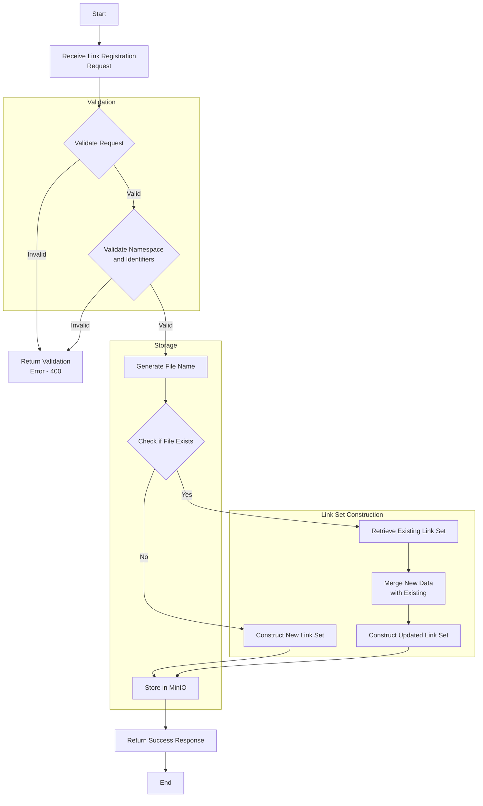

import Disclaimer from './../\_disclaimer.mdx';

<Disclaimer />

# Link Registration

Authorized users can register identity resolvers through the API. The data will be constructed and stored in a JSON file, with the filename determined by the namespace, primary identifier and qualifier path.

## Link Registration Structure

The link registration system uses a JSON structure to define each identity resolver based on the namespace, identification key type, primary identifier, and qualifier path. Here's an example of the structure for a single link registration:

```json
{
  "namespace": "gs1",
  "identificationKeyType": "gtin",
  "identificationKey": "12345678901234",
  "itemDescription": "Product description",
  "qualifierPath": "/10/12345678901234567890",
  "active": true,
  "responses": [
    {
      "defaultLinkType": true,
      "defaultMimeType": true,
      "defaultIanaLanguage": true,
      "defaultContext": true,
      "fwqs": false,
      "active": true,
      "linkType": "gs1:certificationInfo",
      "ianaLanguage": "en",
      "context": "au",
      "title": "Certification Information",
      "targetUrl": "https://example.com",
      "mimeType": "application/json"
    }
  ]
}
```

## Link Registration Properties

Each link registration JSON object consists of the following top-level properties:

- `namespace`: The namespace of the identifier scheme (e.g., "gs1")
- `identificationKeyType`: The type of the primary identifier (e.g., "gtin")
- `identificationKey`: The value of the primary identifier
- `itemDescription`: A description of the item being identified
- `qualifierPath`: The path of qualifiers, if any
- `active`: A boolean indicating whether this registration is active
- `responses`: An array of response objects associated with this registration

## Response Properties

Each response object within the `responses` array consists of the following properties:

- `defaultLinkType`: Indicates if this is the default link type when none is specified
- `defaultMimeType`: Indicates if this is the default MIME type when none is specified
- `defaultIanaLanguage`: Indicates if this is the default language when none is specified
- `defaultContext`: Indicates if this is the default context when none is specified
- `fwqs`: A boolean indicating whether to forward the query string to the target URL
- `active`: A boolean indicating whether this response is active
- `linkType`: The type of link, which should be defined in the identifier scheme
- `ianaLanguage`: The IANA language tag for the response (e.g., "en" for English)
- `context`: The context of the response (e.g., "au" for Australia)
- `title`: The title of the link
- `targetUrl`: The target URL of the link
- `mimeType`: The MIME type of the response (e.g., "application/json")

The response is used to construct the link type of link set that follows the [RFC 9264](https://datatracker.ietf.org/doc/html/rfc9264).

## Link Registration Flow

The following diagram illustrates the flow of the link registration process, including validation, link set construction, and storage for both new registrations and updates (upserts):



### Process Description:

1. **Receive Link Registration Request**: The system receives a link registration request from an authorized user.

2. **Validate Request**: The request is validated for proper structure and required fields.

3. **Validate Namespace and Identifiers**: The system checks if the namespace exists and if the identifiers are valid according to the registered identifier scheme.

4. **Generate File Name**: A unique file name is generated based on the namespace, identification key type, primary identifier, and qualifier path.

5. **Check if File Exists**: The system checks if a file with the generated name already exists in MinIO.

6. **Construct Link Set**:

   - For new registrations: If the file doesn't exist, the system constructs a new link set according to [RFC 9264](https://datatracker.ietf.org/doc/html/rfc9264).
   - For updates: If the file exists, the system retrieves the existing link set, merges it with the new data, and constructs an updated link set.

7. **Store in MinIO**: The constructed link set is stored as a JSON file in MinIO using the bucket name environment variable (OBJECT_STORAGE_BUCKET_NAME), and the generated file name.

8. **Return Success Response**: If storage is successful, a success response is returned to the user.

## Validation Rules

When registering or updating a link resolver, the system enforces the following rules:

1. The namespace must exist in the identifier management system.
2. The identificationKeyType must be a valid Identifier type for the given namespace.
3. The identificationKey must match the regex pattern defined for the Identifier type.
4. If qualifierPath is provided, it must contain valid Qualifier types for the Identifier and match each of the qualifier regex patterns.
5. Each response must have a linkType that is valid for the namespace.
6. The mimeType in each response must be a valid MIME type.
7. IANA Language tag must be a valid language tag.
8. Contexts must be a valid context.
9. Target URLs must be a valid URL.

## API Operations

The Link Registration API supports the following operations:

1. Create or Upset a link registration

See the [API specification](http://localhost:3000/api-docs#/Link%20Registration) for details.
