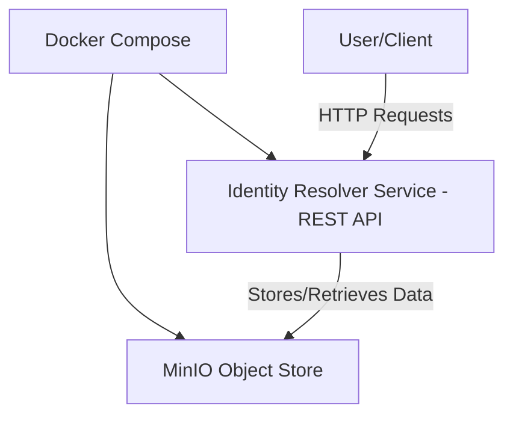

import Disclaimer from './../\_disclaimer.mdx';

<Disclaimer />

# Getting Started

This section will help you quickly set up and understand the core components of the system.

## System Overview

The Pyx Identity Resolver uses Docker Compose to deploy two main services: a REST API (Identity Resolver Service) and a MinIO object store. The API handles identifier management, link registration, and resolution, while MinIO stores system data such as identifier schemes and link sets.

Here’s a high-level architecture of the system you’ll stand up:

