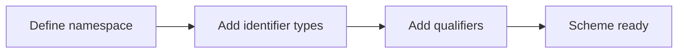
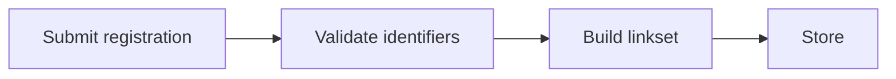
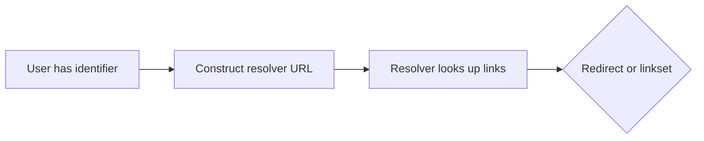

# How It Works

Using the Identity Resolver is a three-step process:

1. **Set up your identifier scheme** — Define what kinds of identifiers your resolver handles.
2. **Register links** — Associate identifiers with information about them.
3. **Resolve identifiers** — Look up an identifier and get directed to the right information.

Let's walk through each step.

## Step 1: Set up your identifier scheme

As the registry operator, before you can register links,
you need to tell the resolver what kinds of identifiers it should recognise.
You do this by creating a **namespace** with **identifier types** and optional **qualifiers**.

A namespace groups related identifier types under a single scheme.
An identifier type is the primary thing you are identifying.
A qualifier adds specificity — like a batch number that narrows down a product.

Here is how the `acme` scheme might be structured:

| Concept | Example | Purpose |
|---------|---------|---------|
| Namespace | `acme` | Groups all Acme identifier types together |
| Identifier type | `product` | The primary identifier (e.g. a product code) |
| Qualifier | `batch` | Adds specificity (e.g. a batch code) |

With this scheme registered, the resolver knows how to parse a path like:

```
/acme/product/12345/batch/A1B2C3
```

It reads this as: "product `12345` in the `acme` scheme, qualified by batch `A1B2C3`."



Each identifier type and qualifier includes a validation pattern (a regular expression)
so the resolver can check that incoming identifiers are well-formed
before attempting to resolve them.

:::info Validation rejects invalid identifiers
If an incoming identifier does not match the regular expression pattern
defined for its identifier type or qualifier,
the resolver rejects the request before it ever reaches the link lookup stage.
This protects against malformed paths and keeps resolution fast.
:::

See the [Developer Guide](../developer-guide/) for the API endpoints
used to create namespaces, identifier types, and qualifiers.

## Step 2: Register links

Once your identifier scheme is set up,
registered members can start registering links against specific identifiers.

A **link registration** associates an identifier
with one or more **responses**.
Each response represents a link to some piece of information —
a sustainability report, a product datasheet, a certification page —
and is described by:

- **Link type** — What kind of information this is (e.g. `acme:sustainabilityInfo`)
- **Target URL** — Where the information lives (e.g. `https://example.com/sustainability-report`)
- **Language** — The language of the resource (e.g. `en` for English)
- **Context** — A regional or situational qualifier (e.g. `au` for Australia)
- **MIME type** — The format of the resource (e.g. `text/html`)

You can register multiple responses for the same identifier,
covering different link types, languages, formats, and contexts.
This is what makes the resolver powerful:
the same product identifier can point to different information
depending on what the user asks for.



For example, you might register the following responses for product `12345`:

| Link type | Language | Context | Target URL |
|-----------|----------|---------|------------|
| `acme:sustainabilityInfo` | `en` | `au` | `https://example.com/sustainability-report` |
| `acme:productDatasheet` | `en` | `au` | `https://example.com/product-datasheet` |
| `acme:certificationInfo` | `en` | `au` | `https://example.com/certification` |

See the [Developer Guide](../developer-guide/) for the full registration API reference.

## Step 3: Resolve identifiers

This is the end-user flow — the moment an anonymous user or authorised user
encounters an identifier and wants to know more about it.

Resolution can happen in two ways:

1. **Redirect** — The user requests a specific link type,
   and the resolver redirects them to the matching target URL.
2. **Linkset** — The user requests all links (using `linkType=all`),
   and the resolver returns a structured JSON document
   listing every available link for that identifier.

A resolution request looks like this:

```
https://your-resolver.example.com/api/2.0.0/acme/product/12345/batch/A1B2C3?linkType=acme:sustainabilityInfo
```

The resolver parses the path, looks up the registered links,
and either redirects the user or returns a linkset.



See the [Developer Guide](../developer-guide/) for the resolution API reference.

### Resolver discovery

How does a client know which resolver to use for a given identifier?
The IDR exposes a **resolver description file** at:

```
/.well-known/resolver
```

This endpoint returns metadata about the resolver —
its name, root URL, supported identifier schemes, and supported link type vocabularies.
Clients and ecosystem registries can use this
to discover what a resolver supports
without making any resolution requests.
See the [Developer Guide](../developer-guide/) for the resolver description endpoint details.

### Link types

Link types describe the nature of the information a link points to.
They follow a `prefix:key` format — for example, `gs1:certificationInfo` or `untp:traceabilityEvent`.

Link types come from controlled vocabularies.
The resolver supports two built-in vocabulary prefixes: `gs1` (GS1 Digital Link vocabulary)
and `untp` (UN Transparency Protocol vocabulary).
When a link is registered, the resolver validates the link type
against the vocabulary for the namespace's configured prefix.
A link type that does not exist in the relevant vocabulary will be rejected at registration time.

The resolver exposes a vocabulary endpoint at `/voc/?show=linktypes`
where clients can discover all available link types
and their descriptions.

## How the resolver picks the right response

When a user resolves an identifier with a specific link type,
the resolver needs to choose the single best response to return.
Since the same link type might have responses registered in different languages,
contexts, and formats,
the resolver follows a precedence chain
to find the most specific match.

### A scenario

Imagine a consumer in Australia scans a product code on their phone.
Their phone's language is set to English,
and their region is Australia.
The scanning app resolves the identifier, requesting `acme:sustainabilityInfo`
and passing along `en` as the language and `au` as the context.

The resolver has **two distinct branches** depending on whether
a link type was provided in the request:

**When a link type is provided** (as in this scenario),
the resolver works through steps 1-7, progressively relaxing specificity:

1. First, it looks for a response matching the exact link type (`acme:sustainabilityInfo`),
   language (`en`), context (`au`), and the requested MIME type.
   If it finds one, it returns it. Done.

2. If no exact MIME type match exists,
   it looks for a response with the same link type, language, and context
   that is marked as the **default MIME type**.

3. If that does not exist either,
   it broadens the search — same link type, language, and context,
   any MIME type.

4. Still no match?
   It tries the same link type and language,
   but with the **default context**.

5. Then just the link type and language, ignoring context entirely.

6. Then the link type with the **default language**.

7. Then just the link type, with no language or context preference.

If none of steps 1-7 produce a match,
the resolver returns no result.
It does **not** fall through to the default link type —
the user asked for a specific link type and it was not found.

**When no link type is provided**,
the resolver skips steps 1-7 entirely and goes straight to step 8:

8. It returns whichever response is marked as the **default link type**.

### Precedence table

| Priority | Match criteria |
|----------|---------------|
| 1 | linkType + language + context + mimeType |
| 2 | linkType + language + context + default mimeType |
| 3 | linkType + language + context |
| 4 | linkType + language + default context |
| 5 | linkType + language |
| 6 | linkType + default language |
| 7 | linkType |
| 8 | default linkType |

:::tip Two branches, not one chain
Steps 1-7 and step 8 are **separate branches**, not a single fallback chain.
If a user requests a specific link type and no response matches (steps 1-7),
the resolver returns no result — it does not fall through to the default link type.
Step 8 only applies when no link type is specified at all.
:::

The implication is straightforward:
the more specific your registrations, the more targeted the responses.
If you register responses for specific language and context combinations,
users in those regions get exactly the right content.
Within the link-type branch (steps 1-7),
fallback ensures that users get the best available match
even when a perfect one is not available.
And when no link type is specified at all,
the default link type (step 8) ensures the user still gets a useful response.

## Default flags

Each response can carry up to four default flags.
These flags tell the resolver
"if nothing more specific matches, use this response."

| Default flag | Scope | Meaning |
|--------------|-------|---------|
| `defaultLinkType` | Entire registration | Use this response when no link type is specified at all |
| `defaultIanaLanguage` | Per link type | Use this response when a link type matches but no language preference is given |
| `defaultContext` | Per link type + language | Use this response when link type and language match but no context preference is given |
| `defaultMimeType` | Per link type + language + context | Use this response when everything else matches but no MIME type preference is given |

:::warning Only one default per scope
Only one response can hold each default flag within its scope.
When you register a new response with a default flag set to `true`,
the system automatically clears that flag
on any existing response in the same scope.
This means the most recently registered default always wins —
you do not need to manually unset previous defaults.
:::

Defaults matter because they guarantee
that resolution always produces a result.
Even if a user resolves an identifier with no preferences at all —
no link type, no language, no context —
the resolver can still return the default link type response.

See the [Developer Guide](../developer-guide/) for how to set default flags via the registration API.

## GS1 Digital Link example

While the examples above use the invented `acme` scheme,
the IDR works with real-world identifier schemes too.
A common one is GS1 Digital Link,
which turns product barcodes (GTINs) into resolvable web addresses.

A registry operator managing GS1 identifiers would set up a `gs1` namespace
with `gtin` as an identifier type and `lot` as a qualifier.
GS1 uses numeric codes called application identifiers for the URL structure —
`01` for GTIN and `10` for lot — so a resolution request might look like:

```
https://your-resolver.example.com/api/2.0.0/gs1/01/09359502000010/10/ABC123?linkType=gs1:certificationInfo
```

Here, `01` is the GS1 application identifier for GTIN (`gtin`),
`09359502000010` is the product code,
`10` is the application identifier for lot,
and `ABC123` is the lot number.
The resolver handles GS1 application identifiers
just like any other identifier scheme —
the only difference is the namespace and identifier type definitions.
